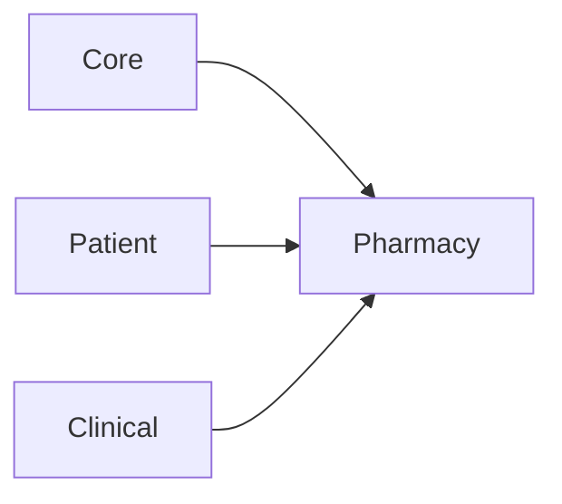

# Pharmacy module

**In one sentence:** The Pharmacy module manages medication catalog, stock, and dispensing so clinical orders can turn into safe, trackable medicine delivery.

## Why this module exists

Hospitals need a clear answer to three questions:

- What medicines do we have?
- How much stock is available right now?
- Who dispensed what, for which patient order?

This module keeps that workflow in one place and links it to patient and clinical context.

## Where Pharmacy fits in FlowRise

- **Depends on Core** for shared system foundations.
- **Depends on Patient and Clinical** so medication work is tied to the right person and request item.
- Integrates with clinical `RequestItem` records by attaching pharmacy `Dispense` relations.

## What you can do with it

- Maintain a **medication catalog**.
- Track **stock items** and stock movement reasons.
- Place and process **medication orders**.
- Record **dispensing events** against clinical request items.
- Enforce safety/business checks (for example insufficient stock exceptions).

## How it works (simple)

1. Clinical staff place medication-related requests in clinical workflows.
2. Pharmacy services validate stock and medication details.
3. Dispensing records are created and linked back to clinical request items.
4. Stock levels and movement metadata are updated for traceability.

## What is inside this folder

| Path | Purpose |
|------|---------|
| `app/Models/` | Medication, stock, and dispense entities. |
| `app/Classes/Services/` | Stock, ordering, and dispense business logic. |
| `app/Filament/` | Pharmacy plugin/UI integration points. |
| `app/Enums/` | Controlled schedules, dosage forms, stock reasons. |
| `app/Exceptions/` | Domain-specific pharmacy errors. |
| `app/Providers/` | Module boot/register logic and route/event providers. |
| `database/migrations/` | Pharmacy schema changes. |

## Dependencies

- `flowrise-hms/core`
- `flowrise-hms/clinical`
- `flowrise-hms/patient`

See [module status](../../docs/shared/module-status.md) for rollout state.

## Further reading

- Project-level docs: [docs/README.md](../../docs/README.md)
- Clinical workflows context: [docs/user-guide/clinical-workflows.md](../../docs/user-guide/clinical-workflows.md)

## For developers

- **Namespace:** `Modules\Pharmacy\...`
- **Service provider:** `Modules\Pharmacy\Providers\PharmacyServiceProvider`
- Boot-time relation extension: `RequestItem::resolveRelationUsing('dispenses', ...)`
- Stock abstraction is bound via `StockProviderContract` -> `StockService`.
