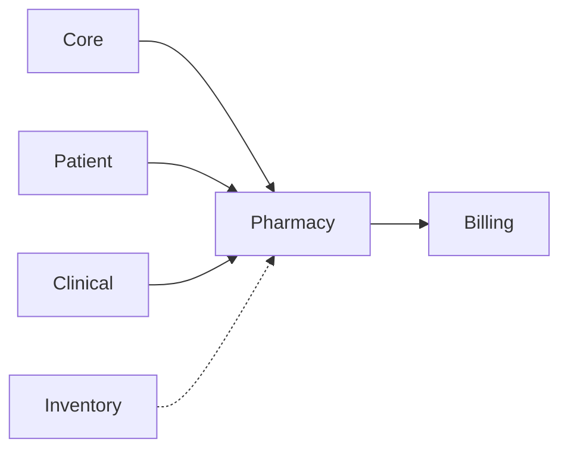

# Pharmacy module

**In one sentence:** The Pharmacy module manages medication catalog, stock, and dispensing so clinical orders can turn into safe, trackable medicine delivery.

## Why this module exists

Hospitals need a clear answer to three questions:

- What medicines do we have?
- How much stock is available right now?
- Who dispensed what, for which patient order?

This module keeps that workflow in one place and links it to patient and clinical context.

## Where Pharmacy fits in FlowRise

- **Depends on Core** for shared system foundations, settings (`PharmacySettings`, POS payment policy on Application settings) and the `StockProviderContract`.
- **Depends on Patient and Clinical** so medication work is tied to the right person and request item; Pharmacy supplies the `PrescriptionScheduleCalculator` that Clinical's MAR uses to plan doses.
- Integrates with clinical `RequestItem` records by attaching pharmacy `Dispense` relations and `PrescriptionDetail` rows.
- **Billing** receives POS sales and dispensing charges (pay now, or "Send to Billing" onto the patient's draft invoice) and provides the pending-charges panel (`PatientPendingChargesService`).
- **Inventory** (optional) can back pharmacy stock with the central store (`StockProviderContract` → `StockService`; "Request from central store" on stock items).

```mermaid
flowchart LR
  Core[Core]
  Patient[Patient]
  Clinical[Clinical]
  Billing[Billing]
  Inventory[Inventory]
  Pharmacy[Pharmacy]
  Core --> Pharmacy
  Patient --> Pharmacy
  Clinical --> Pharmacy
  Pharmacy --> Billing
  Inventory -.-> Pharmacy
```

## What you can do with it

- Maintain a **medication catalog** (Patient Care → Pharmacy → Medications; create from the **Drugs** formulary or import CSV) and the reference **Drugs** list (FDA NDC import, RxNorm lookup).
- Track **stock items** (quantity, reorder point per branch) and **stock movements** (dispense, receive, adjust, transfer).
- Place **medication orders** from the Clinical Workspace and fulfil them from the **Point of Sale** page (Workspaces group): dispense from stock, record outside purchases, print prescription slips.
- Record **dispensing events** against clinical request items (in-house, outside purchase, supply only).
- Run **Point of Sale** checkout for walk-in / guest or OTC sales, with "Pay now" (cash, card, bank transfer, mobile money) or "Send to Billing", discounts, receipts, and settling of pending charges.
- Review the **Pharmacy report** (sales, dispensing, MAR adherence, low stock) and dashboard widgets (operations stats, dispensing queue, low stock overview).
- Enforce safety/business checks (for example insufficient stock exceptions, payment-before-dispense flags).

## How it works (simple)

1. Clinical staff place medication-related requests in clinical workflows.
2. Pharmacy services validate stock and medication details.
3. Dispensing records are created and linked back to clinical request items.
4. Stock levels and movement metadata are updated for traceability.

## What is inside this folder

| Path | Purpose |
|------|---------|
| `app/Models/` | `Medication`, `Drug`, `StockItem`, `StockMovement`, `Dispense`, `PrescriptionDetail`. |
| `app/Classes/Services/` | `MedicationService`, `MedicationOrderService`, `DispenseService`, `StockService`, `PharmacyPosCheckoutService`, `PharmacyPosPrescriptionService`, `PrescriptionScheduleCalculator`, `PrescriptionSlipPresenter`, `MedicationBillingSyncService`, `MedicationMergeService`, `DrugMaterializationService`, `DrugMedicationResolver`, `DrugSearchService`, `ExternalDrugLookupService` / `RxNormService` / `OpenFdaService`, `PharmacyAnalyticsService`, `MedicationSearchOptionFormatter`. |
| `app/Filament/` | `PharmacyPlugin`; `PharmacyCluster` (Patient Care group) with resources Medications, Drugs, Stock Items, Stock Movements, Dispenses and pages Pharmacy report, Pharmacy settings; the top-level `PharmacyPos` page (Workspaces group); `Concerns/HandlesPosPrescriptionFulfillmentActions`; importers (`MedicationImporter`, `DrugImporter`), exporters (`MedicationExporter`, `DispenseExporter`); report widgets and dashboard widgets. `app/Livewire/PatientPrescriptionsTable` is the prescription table embedded in the POS. |
| `app/Enums/` | `ControlledSchedule`, `DosageForm`, `MedicationFrequency`, `MedicationRoute`, `AdministrationContext`, `DispenseFulfillmentType`, `StockMovementReason`. |
| `app/Console/` | `fda-ndc:import`, `pharmacy:backfill-medication-services`, `pharmacy:backfill-medication-units`, `pharmacy:backfill-prescription-details`, `pharmacy:merge-duplicate-medications`. No scheduled tasks. |
| `app/Settings/PharmacySettings.php` | POS defaults (pay-now allowed, default charge mode, payment methods, guest checkout, services tab), RxNorm lookup toggle; "Block controlled substances on POS" and "Default reorder point" are stored but not read. |
| `app/Exceptions/` | Domain-specific pharmacy errors. |
| `app/Providers/` | Module boot/register logic and route/event providers. |
| `database/migrations/` | 19 migrations. |
| `routes/` | `GET /pharmacy/prescription-slip/{requestItem}` and `/pharmacy/prescription-slip/combined` (printable slips); REST `drugs` (index/show) and `dispenses` (index/show/update) when the Api module is enabled. |

## Dependencies

- `flowrise-hms/core`
- `flowrise-hms/clinical`
- `flowrise-hms/patient`

See [module status](../../docs/shared/module-status.md) for rollout state.

## Further reading

- **Staff-facing workflows:** [Pharmacy Workflows](../../docs/user-guide/pharmacy.md)
- Project-level docs: [docs/README.md](../../docs/README.md)
- Clinical workflows context: [docs/user-guide/clinical-workflows.md](../../docs/user-guide/clinical-workflows.md)

## For developers

- **Namespace:** `Modules\Pharmacy\...`
- **Service provider:** `Modules\Pharmacy\Providers\PharmacyServiceProvider`
- Boot-time relation extension: `RequestItem::resolveRelationUsing('dispenses', ...)`
- Stock abstraction is bound via `StockProviderContract` -> `StockService`.
- **Custom permissions:** `order_prescription_medication`, `administer_medication`, `dispense_medication`, `manage_pharmacy_settings`; page permission `View PharmacyPos`; widget permissions `View <Widget>`.
- **Tests:** `php artisan test --compact Modules/Pharmacy/tests` (29 test files). Verified against code on 2026-09-20.
